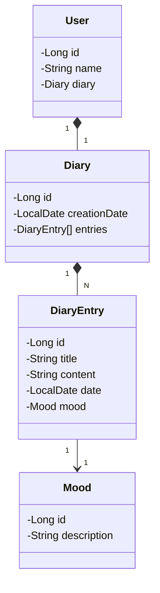

# API Diary
API de Diário.

## Diagrama de Classes 

```mermaid
classDiagram
	class User {
	  -Long id
	  -String name
	  -Diary diary
	}

	class Diary {
	  -Long id
	  -LocalDate creationDate
	  -DiaryEntry[] entries  
	}

	class DiaryEntry {
	  -Long id
	  -String title
	  -String content
	  -LocalDate date
	  -Mood mood
	}

	class Mood {
	  -Long id
	  -String description
	}

	User "1" *-- "1" Diary
	Diary "1" *-- "N" DiaryEntry
	DiaryEntry "1" --> "1" Mood
```
